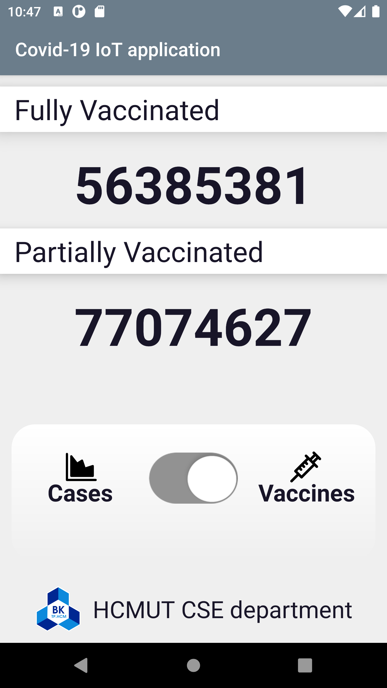
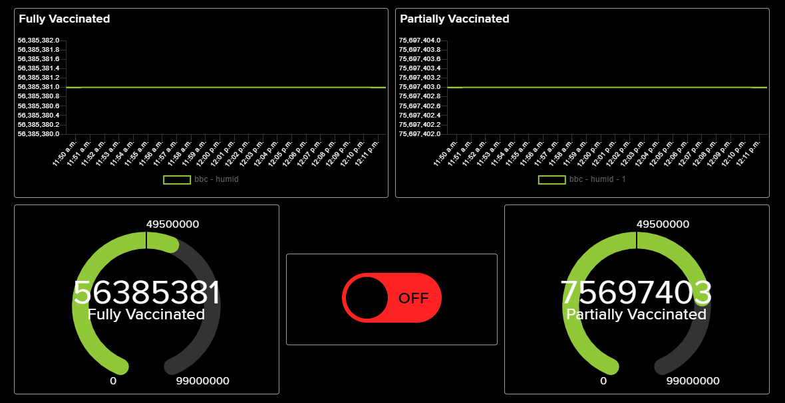
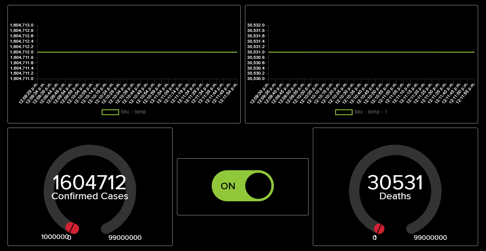

# Covid-19 IoT application

> Android application for my study in ***Internet of Things Application Development*** course (*CO3037*) at Ho Chi Minh university of Technology.

 

<!--  -->

The project consists of 3 components: <a href="#gateway">Gateway</a>, <a href="#server">Server</a> and <a href="#android-application">Android application</a>, implemented separately and connected using **MQTT** protocol. The project's code skeleton was implemented by my tutor in the course, Dr. Le Trong Nhan (GitHub: [nhanksd](https://github.com/nhanksd85)).

## Gateway
  - Use Python for implementation.
  - Import Adafruit IO library for connecting and subscribing to [Adafruit IO](https://io.adafruit.com/) server with MQTT protocol.
  - Establish serial connection to gateway with [com0com](http://com0com.sourceforge.net/) and hercules application.
  - Import requests library for fetching JSON API to get [Covid-19 stats](https://github.com/M-Media-Group/Covid-19-API) and then publish to Adafruit IO server.
  - Proccess data transmitted by hercules in format `!MODE:0##` for mode 0 (reading cases data) and `!MODE:1##` for mode 1 (reading vaccination data).

## Server

   
   
  <i>Two dashboards for each mode</i>

  - Use [Adafruit IO](https://io.adafruit.com/) online server.
  - Use provided **dashboard** and **feed** on Adafruit for displaying data received from gateway using MQTT protocol.
  - Create 2 dashboards corresponding to each mode.
  - Create 4 feeds, each will get data of Confirmed case, death, people full vaccinated and partially vaccinated, and an additional feed for the mode.

## Android application

  - Receive data published previously on Adafruit IO server by the Gateway.
  - Switch button used to display current mode.
  - If current mode is 0, change the content of 2 `TextView` to *Confirmed cases* and *Death* and display data received from server.
  - Otherwise, change the content of 2 `TextView` to *Fully vaccinated* and *Partially vaccinated*.
  - Layout can be found at `app\src\main\res`.
  - Java source for main activity and MQTT protocol can be found at `app\src\main\java\vn\iot\dashboard`.
